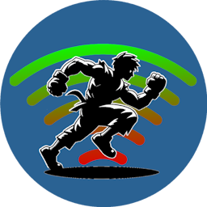

[](https://github.com/lucasteles/Backdash/actions/workflows/ci.yml)
[](https://www.nuget.org/packages/Backdash)


# Backdash 🕹️



### ⚠️ **WORKING IN PROGRESS**

Fully C# [Rollback Netcode](https://en.wikipedia.org/wiki/Netcode#Rollback) implementation heavily inspired
on [GGPO](https://github.com/pond3r/ggpo) with full asynchronous IO support.

## Getting started

[NuGet package](https://www.nuget.org/packages/Backdash) available:

```ps
$ dotnet add package Backdash
```

## Samples

Check the samples on [/samples](/samples) 

### Video Demos:

| Title           | Link    |
| --------        | ------- |
| Console         | [](https://youtu.be/n-3G0AE5Ti0)    |
| Monogame Local  | [](https://youtu.be/JYf2MemyJaY)     |
| Monogame Online | [](https://youtu.be/LGM_9XfzRUI)    |


