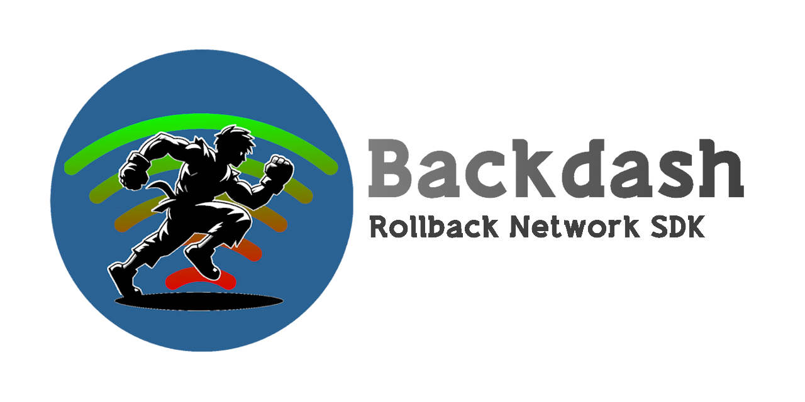

[](https://github.com/lucasteles/Backdash/actions/workflows/ci.yml)
[](https://www.nuget.org/packages/Backdash)


# Backdash 🕹️



Highly configurable and extensible implementation
of [Rollback Netcode](https://en.wikipedia.org/wiki/Netcode#Rollback) with full asynchronous IO.

> **Heavily** inspired by [GGPO](https://github.com/pond3r/ggpo).

## Overview

Traditional techniques account for network transmission time by adding delay to a players input, resulting in a
sluggish, laggy game-feel. Rollback networking uses input prediction and speculative execution to send player inputs to
the game immediately, providing the illusion of a zero-latency network. Using rollback, the same timings, reactions,
visual and audio queues, and muscle memory your players build up playing offline will translate directly
online. [Backdash](https://github.com/lucasteles/Backdash) is designed to make incorporating rollback networking (_aka.
Rollback [Netcode](https://words.infil.net/w02-netcode.html)_) into new and existing games as easy as possible.

## Getting started

[NuGet package](https://www.nuget.org/packages/Backdash) available:

```ps
$ dotnet add package Backdash
```

### Demos:

| Title           | Link                                                                                                   |
|-----------------|--------------------------------------------------------------------------------------------------------|
| Console         | [](https://youtu.be/n-3G0AE5Ti0)         |
| Monogame Local  | [](https://youtu.be/JYf2MemyJaY)  |
| Monogame Online | [](https://youtu.be/LGM_9XfzRUI) |

## Samples

Check the samples on the [/samples](https://github.com/lucasteles/Backdash/tree/master/samples) directory:

There are examples for up to 4 players:

- [Simple console game](https://github.com/lucasteles/Backdash/tree/master/samples/ConsoleGame)
- [Monogame SpaceWar](https://github.com/lucasteles/Backdash/tree/master/samples/SpaceWar)
- [Monogame SpaceWar with Lobby over internet](https://github.com/lucasteles/Backdash/tree/master/samples/SpaceWar.Lobby) [^1]

[^1]: The sample needs a [web server](https://github.com/lucasteles/Backdash/tree/master/samples/LobbyServer) to
exchange players addresses. check the sample `README.md` for more information.

## Licensing

[Backdash](https://github.com/lucasteles/Backdash) is available under The MIT License. This
means [Backdash](https://github.com/lucasteles/Backdash) is free for commercial and non-commercial use.
Attribution is not required, but appreciated.
